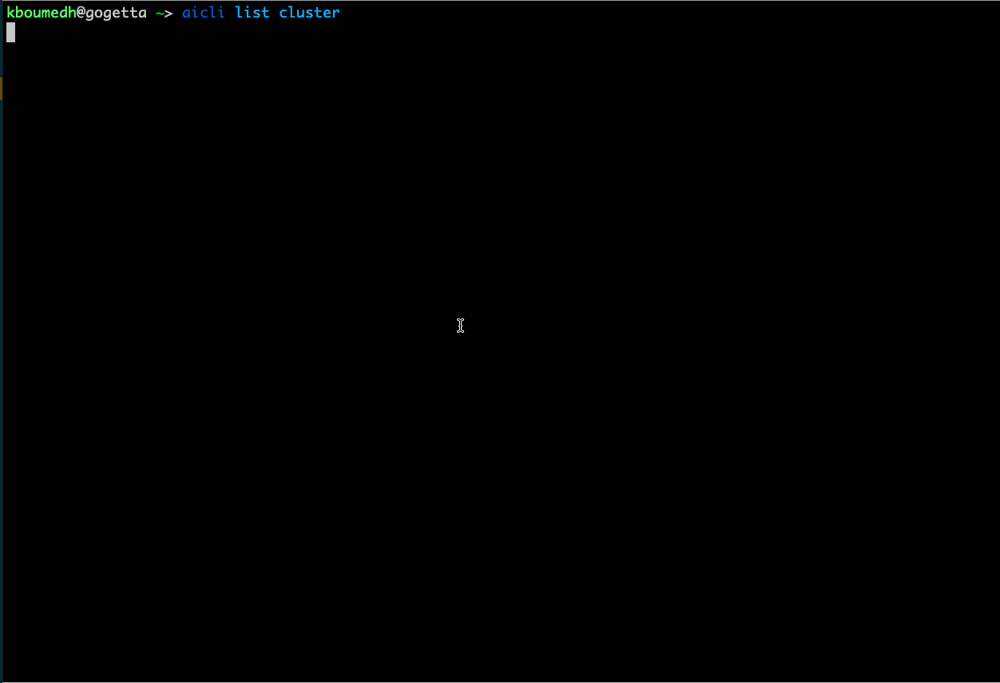

| :warning: The tool described in this repository is not supported in any way by Red Hat!!! |
|-------------------------------------------------------------------------------------------|

# aicli repository


[](https://pypi.python.org/pypi/aicli/)
[](https://copr.fedorainfracloud.org/coprs/karmab/kcli/package/aicli)
[](https://aicli.readthedocs.io/en/latest/?badge=latest)
[](https://microbadger.com/images/karmab/aicli "Get your own image badge on microbadger.com")


## Demo!



# Description

This is a sample python client on top of the generated assisted-installer python library to ease working with assisted installer API

Refer to the [documentation](https://aicli.readthedocs.io) for more information

## Quick Start

To use with SAAS, gather an offline token at [https://cloud.redhat.com/openshift/token](https://cloud.redhat.com/openshift/token), then

```
sudo dnf -y copr enable karmab/aicli ; sudo dnf -y install aicli
```

or

```
pip3 install aicli
```

or 

```
alias aicli='podman run --net host -it --rm -e AI_OFFLINETOKEN=$AI_OFFLINETOKEN -v $HOME/.aicli:/root/.aicli -v $PWD:/workdir quay.io/karmab/aicli'
```

##  What you can do

- create/delete cluster (autoinjecting pull secret file and ssh public key, static networking)
- create/delete manifests
- download discovery iso
- wait for hosts
- list cluster/hosts
- update hostnames and host roles
- update cluster attributes such as api vip and ingress vip
- launch cluster install
- wait for cluster
- create day2 cluster for adding hosts

## Contributors

See [contributors on GitHub](https://github.com/karmab/aicli/graphs/contributors)

## Copyright

Copyright 2020-2022 Karim Boumedhel

Licensed under the Apache License, Version 2.0 (the "License");
you may not use this file except in compliance with the License.
You may obtain a copy of the License at

    http://www.apache.org/licenses/LICENSE-2.0

Unless required by applicable law or agreed to in writing, software
distributed under the License is distributed on an "AS IS" BASIS,
WITHOUT WARRANTIES OR CONDITIONS OF ANY KIND, either express or implied.
See the License for the specific language governing permissions and
limitations under the License.

## Problems?

Open an issue !

Mc Fly!!!

karmab
